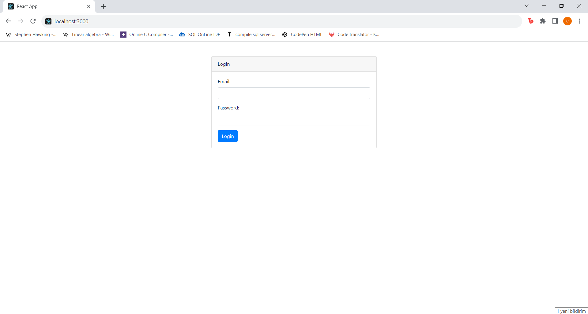
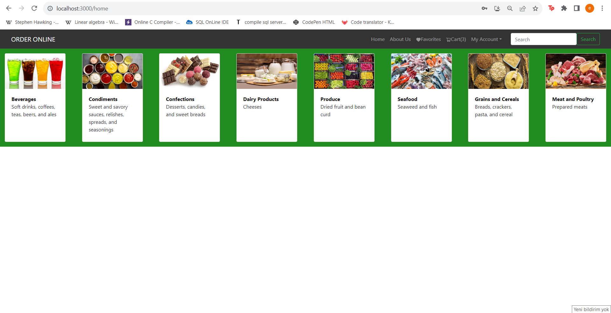
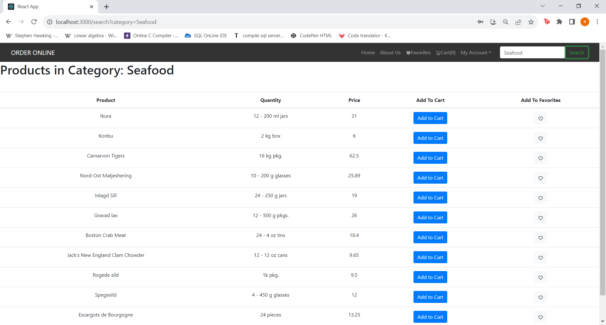
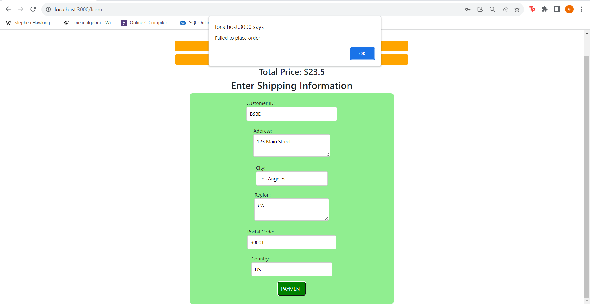
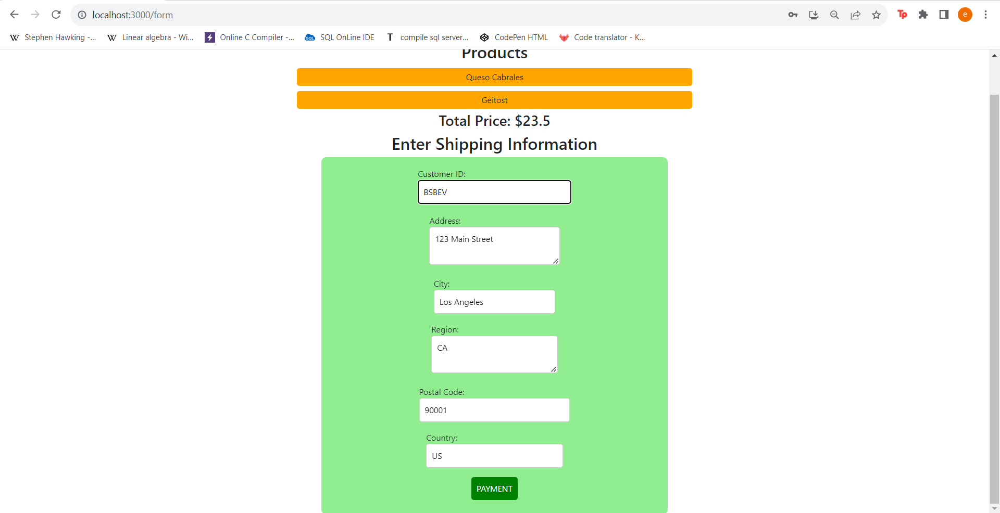
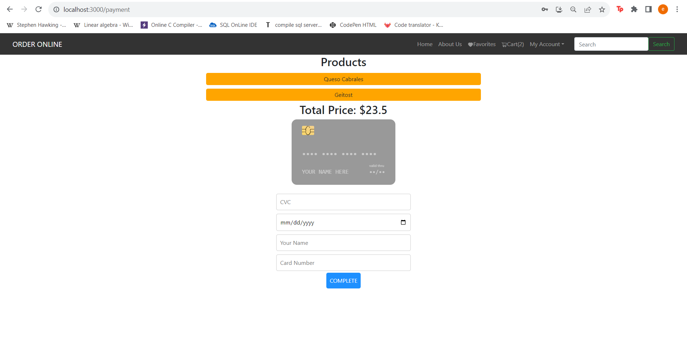
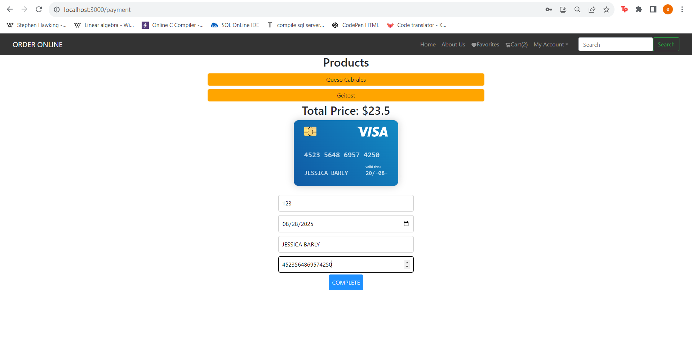
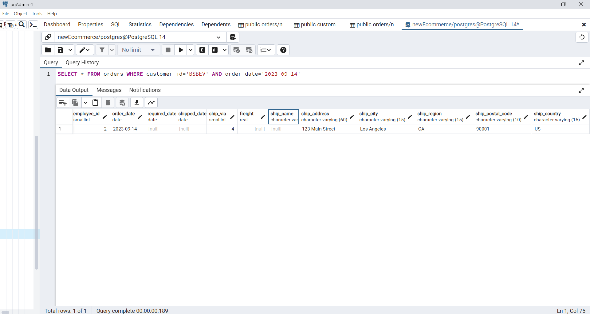
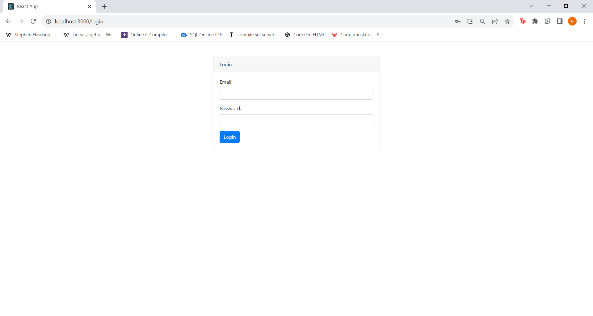

# e-commercee

This project is an e-commerce web application developed using the PERN (PostgreSQL, Express, React, Node.js) technology stack.

## Login: 
Users must log in with their email and password before logging in. They receive warning messages when they try to log in with incorrect information.

## Home Page:
After logging in, categories are listed on the home page. Users can view related products by clicking on categories.

## Products:
After clicking on the category, products in the relevant category are listed. Users can add products to cart or favorites.

## Search Category/List Products:
Category searches can be made with the search bar and products belonging to this category are listed on another page.

## Cart and Favorites:
Users can view their cart and favorite products and delete products from favorites or cart.

## Make an Order:
Users can confirm their carts and be directed to order form page. In the form, user enter a customer id. If the customer does not exist, order isn't placed. Else, user is directed to the payment page.

## Payment:
Users enter their credit card information and click the "Complete" button to complete the order.

## Order Successfull:
Once the payment is confirmed, the user is redirected to a page showing that the order has been completed successfully. Order information is added to the database and the cart is emptied.

## Employees:
In "Our Team" page, user can see employees in the company.

## Suppliers:
In "About Us" page, user can see suppliers company work with.

## Logout:

# Requirements and Installation:
There are the following requirements to run the project:

-Node.js must be installed.
-'npm install' command can be used to install dependencies.
-PostgreSQL is used for database setup.

