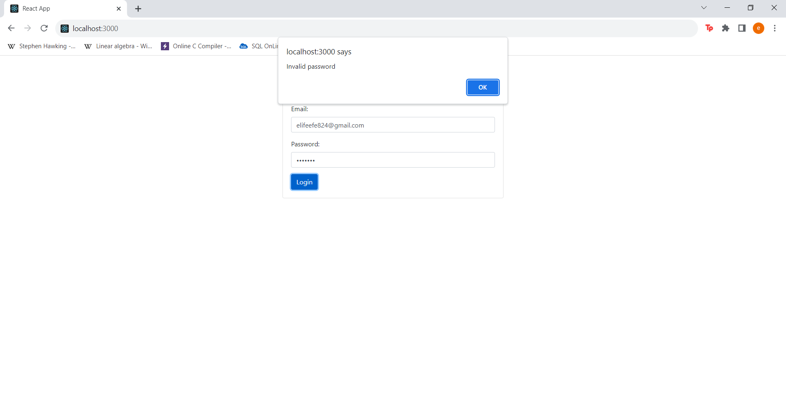

# e-commercee

This project is an e-commerce web application developed using the PERN (PostgreSQL, Express, React, Node.js) technology stack.

# Login: 
Users must log in with their email and password before logging in. They receive warning messages when they try to log in with incorrect information.

# Home Page:
After logging in, categories are listed on the home page. Users can view related products by clicking on categories.

# Products:
After clicking on the category, products in the relevant category are listed. Users can add products to cart or favorites.

# Search Category/List Products:

